# CURATING WORKFLOW

An excel formatting workflow to be done proceding the DADA2 workflow and preceding rarefaction. From the DADA2 workflow we created a `count.csv` file and a `taxonomy.csv` file. In this workflow we will combine the two tables and curate the data.

# Merging of DADA2 Output

From the previous workflow, you should have both a `count.csv` file and a `taxonomy.csv` file. Download both of these files (if you are using R-Studio) and open in Excel.
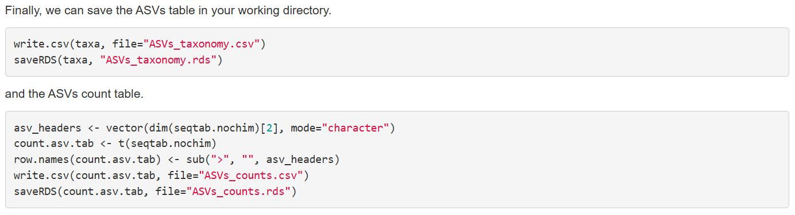

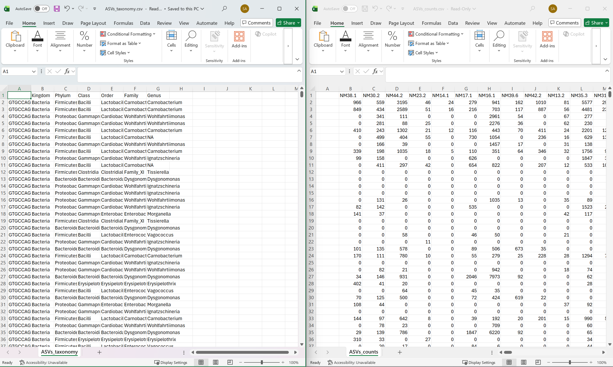

We are going to merge these two tables into one, singular table that is usable in our rarefaction workflow and easier to curate. Firstly, go to your `taxonomy.csv`, now open in Excel, and procede to right-click and delete all of column A.

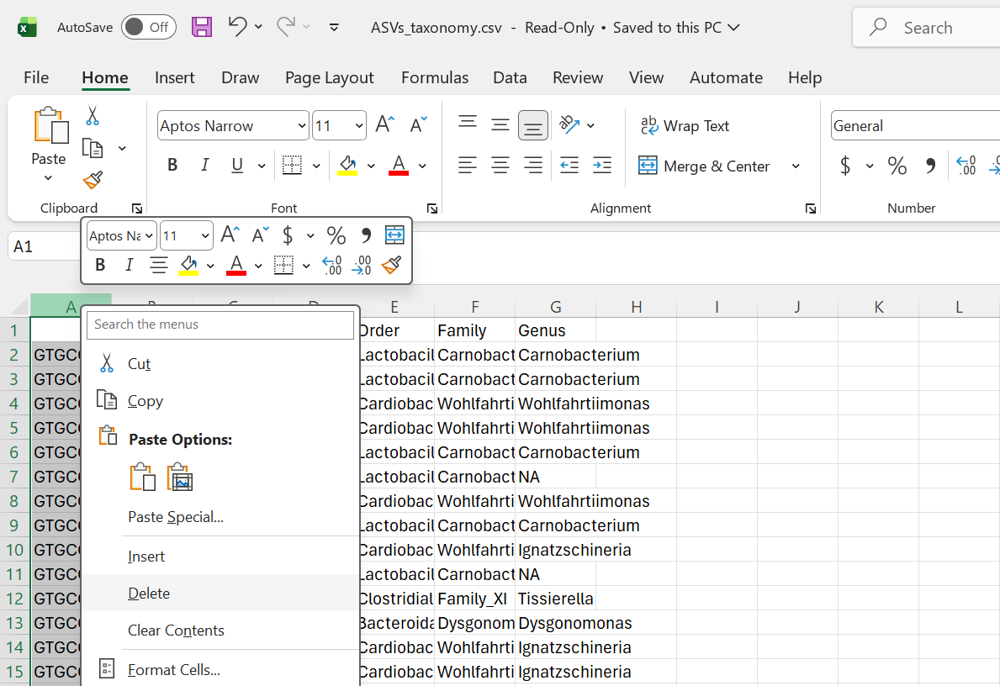

Now type `taxonomy` into cell `H1`. And type `=TEXTJOIN(";", TRUE, A2:F2)` into cell `H2`, this combines all taxonomic ranks. Drag down to repeat the `TEXTJOIN` command till you reach the bottom.

>[!Important]
> Syntax is very important in a lot of these workflows. For example, in later processes, putting `Taxonomy` instead of `taxonomy` in H1 will lead to biom-format not cooperating.

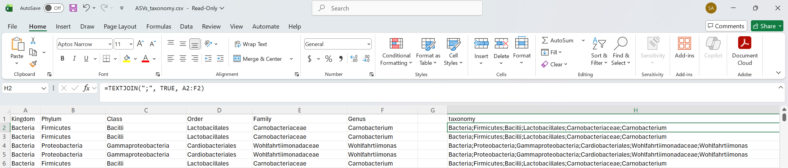

Now copy all of column `H` and `paste as values` in your `counts.csv` file.

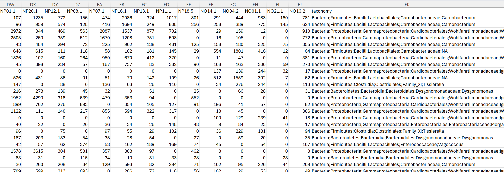

Now you have successfully merged the DADA2 output. You may save and close the `taxonomy.csv` file, but keep the `counts.csv` file open for these next steps.

# Curating

>[!Important]
> Include data on everything that you curated out in this step. That includes categories removed as well as how much.

Select all of your taxonomy column (for me this is column EK, I have a lot of samples in my example) then click `Find & Select` underneath `Home` in Excel.

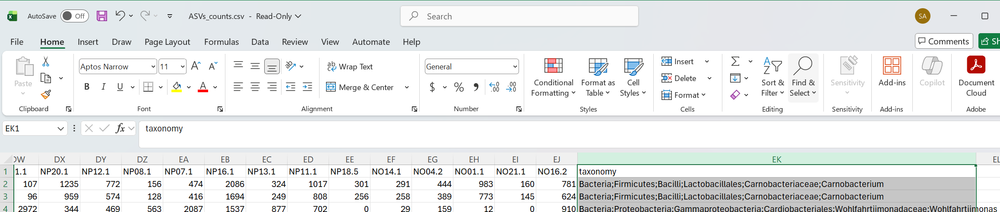

Select the `Find` option. Firstly we will remove all unidentified taxa. So type `NA;NA;NA;NA;NA;NA` into the `Find what:` box and select `Find All`.

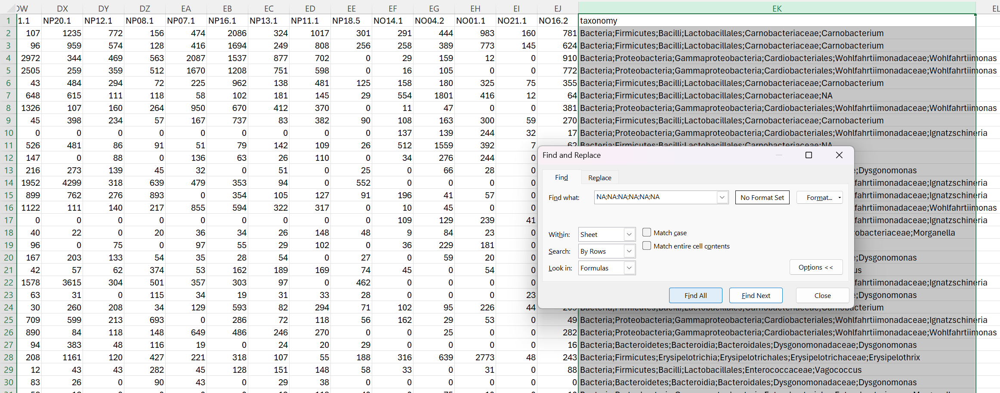

Then use the shortcut `CTRL-A` to select all the unidentified taxa.

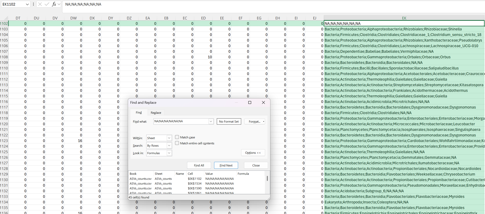

>[!Tip]
> These following steps in particular may very based on your version of Excel, reach out to either Dr Ayayee or myself for troubleshooting

Now after using the `CTRL-A` shortcut, hit the `Close` button.

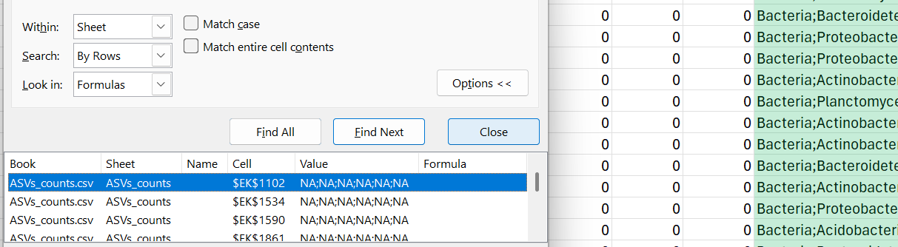

Now right-click on the cell highlighted and select `Delete...`

Then select  `Entire row` and hit `OK`

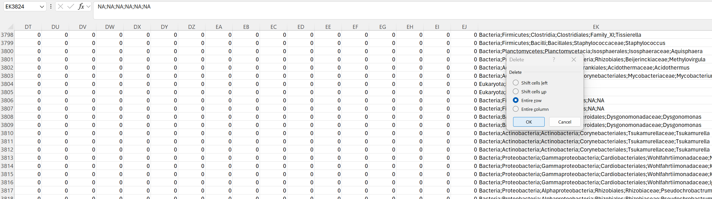

Now all of the rows containing a cell with `NA;NA;NA;NA;NA;NA` should have been removed.

>[!Tip]
> To double-check this you may use the `Find & Select` tool again

Now repeat this process for variables other than `NA;NA;NA;NA;NA;NA`, these include the following:

`Chloroplast`
`Mitochondria`
`Eukaryota`

# ASV IDs

Last thing remaining is to go to cell `A1` and type `#OTU ID` and hit enter. Then go to cell `A2` and type ASV_1 and drag down till you hit the bottom, your table should look something like this:

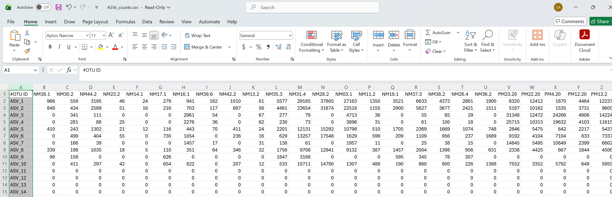

Then your done! Save the file as something such as `ASV.csv` and move on to rarefaction.