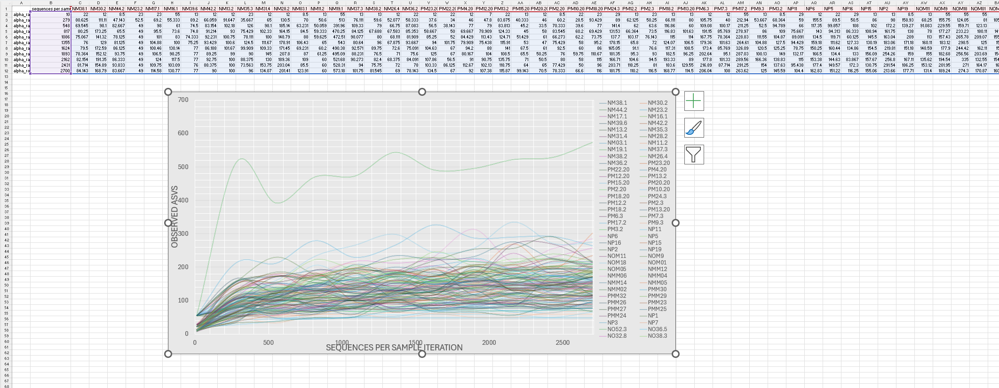

# RAREFACTION WORKFLOW

This section of the workflow is meant to come after the DADA2 Pipeline and curation steps.

This workflow was developed in [Swan](https://swan.unl.edu/), a bash terminal I had access to from the Holand Computing Center. However, this tutorial may be followed in any bash termal with access to the needed programs: QIIME v1.9, Python v3.3, and biom-format.

# Rarefying

```shell
cd /work/labname/username/directory

module load python

module load qiime/1.9

module load biom-format

# use the combined ASV table, you may seperate it back into a count and taxonomy table again after rarefying

biom convert -i ASV.csv -o ASV.biom --table-type="OTU table" --process-obs-metadata taxonomy --to-json

biom summarize-table -i ASV.biom -o ASV_summary.txt

cat training_summary.txt

```

> [!IMPORTANT]
> This will give you data on your ASVs and counts, from this data you will choose the minimum value as the level to rarefy at. You may use other methods, however this almost always 
> works perfectly for me.

```shell
single_rarefaction.py -i ASV.biom -o ASV_RAR.biom -d rarefaction_level # insert your minimum value here as the rarefaction level

biom convert -i ASV_RAR.biom -o ASV_RAR.txt --to-tsv --header-key taxonomy # converting back to txt
```

# Plotting Rarefaction Curve

You *CAN* stop here. However, it is best practice to be able to visualize your rarefaction curve, the rest of this tutorial illustrates how you may do so.

```shell
alpha_rarefaction.py -i  ASV.biom -o RAR/ -m metadata.txt -e rarefaction_level
```

> [!IMPORTANT]
> From this command you should recieve an output folder `RAR/` in your directory, open it to find four folders and a `.txt` file. Open the folder that 
> is named `rarefaction/`. From here you will need a random number generator to generate a random number between 0 and 9. For this I prefer to go into 
> excel and type in the first cell `=RANDBETWEEN(0, 9)`. Then go back to your `rarefaction/` folder and selection every `.biom` file with that number at the 
> end of the filename. Move these files into a seperate folder, as these are the randomly selected values we will use to plot our rarefaction curve in 
> excel. I like to name this folder `RAR_<the number randomly generated>/`, such as `Rar_0/` or `Rar_6/`. In this example I am using `Rar_3/`.

```shell
alpha_diversity.py -i RAR_3/ -m chao1 -o ADIV/

collate_alpha.py -i ADIV/ -o collated_alpha/
```

Open the `collated_alpha/` folder that is now in your directory and you should find a file named `chao1.txt` this is what you can use to plot the rarefaction curve in excel. It may take some configuring, however, it should look something like this:

