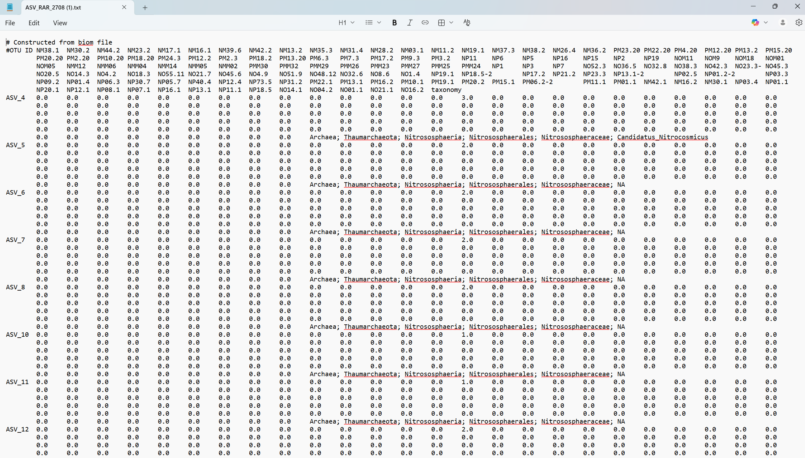
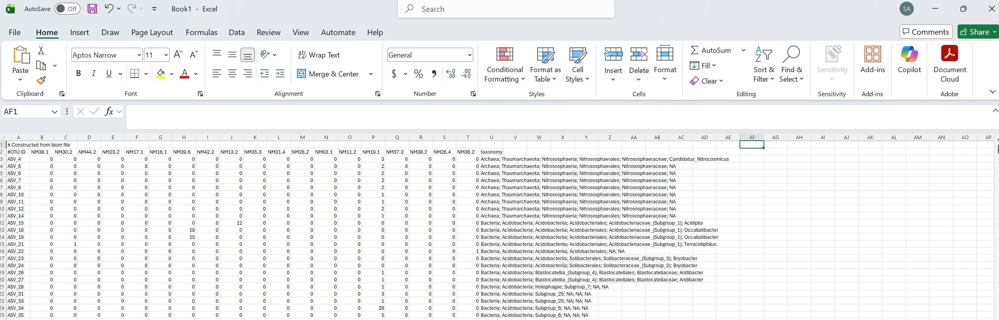
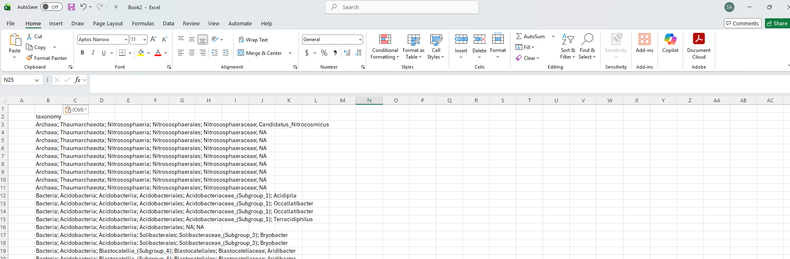
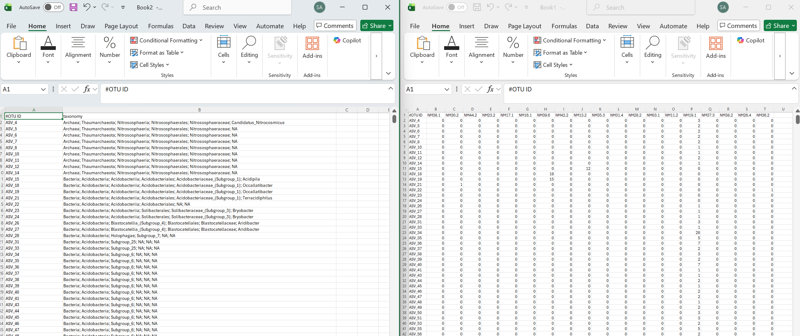

# EXCEL FORMATTING - POST RAREFACTION

An excel formatting workflow to be done proceding rarefaction and preceding phyloseq. This preps the now rarefied `count.csv` and `taxonomy.csv` files for work in R-Studio.

> [!Warning]
> To be overhauled in later versions as to make Excel obsolete and potentially as to not need to separate the files in the first place.

# Getting Started

First download and open the `ASV_RAR.txt` file made in the previous tutorial. It should look something like this:

Now `select all` and `copy` the entire text file and `paste` into a new, blank excel spreadsheet. It should look like this:

Name this excel spreadsheet something like `COUNT_RAR.csv`.

Now what you will want to do is select the entire taxonomy column (`column U` in my example) and paste it into `column B` of another new excel spreadsheet. It should look like this:

Name this excel spreadsheet something like `TAXA_RAR.csv`.

Now delete the taxonomy column in your `COUNT_RAR.csv` file. Then proceed to copy all of `column A` of your `COUNT_RAR.csv` file and paste it into `column A` of the `TAXA_RAR.csv` file. Finally, in both files, remove the entire top row which contains the `#Constructed from biom file`. Now both files should look something like this:

Now save both files and add them to your working directory.