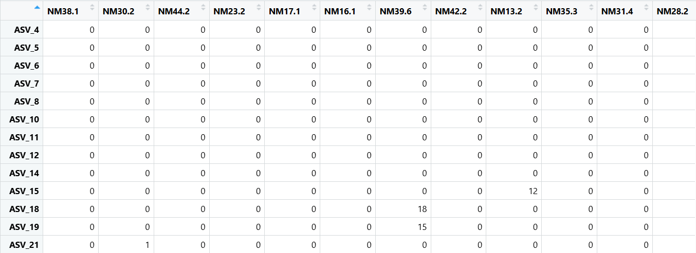
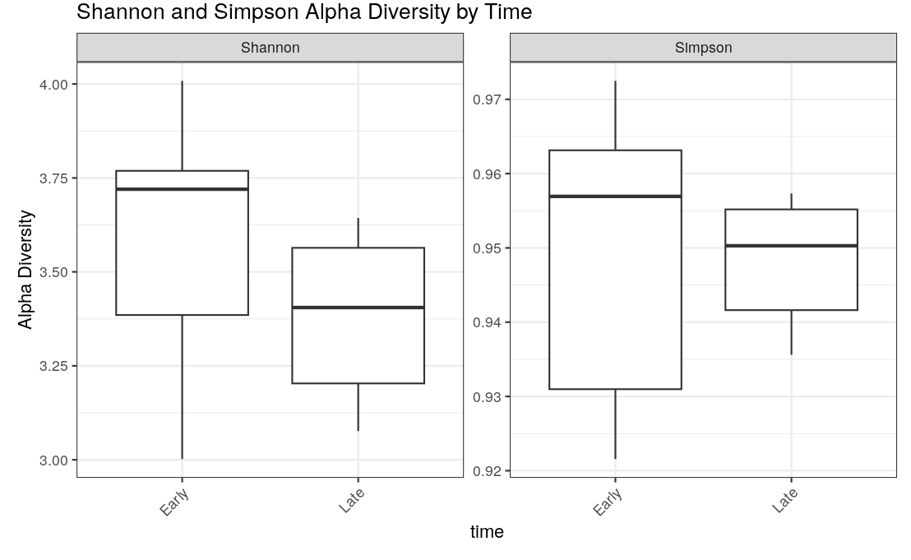

# PHYLOSEQ/DIVERSITY ANALYSIS IN R-STUDIO

# Installing Packages

You will want to install the following packages, if already installed, you may move onto the next step.

```R
install.packages("vegan")
BiocManager::install("phyloseq")
install.packages("tidyverse")
install.packages("patchwork")
install.packages("agricolae")
install.packages("FSA")
install.packages("rcompanion")
```

# Loading Packages

Now load those same packages.

```R
library("vegan")
library("phyloseq")
library("tidyverse")
library("patchwork")
library("agricolae")
library("FSA")
library("rcompanion")
library(microbiome)
library(knitr)
```

# Creating a Phyloseq Object

Now we will create a phyloseq object that will compile our metadata and our rarefied taxa and count files. First, set your directory.

```R
setwd("/work/labname/username/directory/")
```

Next we will prepare our `.csv` files for use in the phyloseq object, first we will do our `COUNT_RAR.csv` file, which will be our "otu table" in our phyloseq object.

```R
otu_data <- read.csv("COUNT_RAR.csv", stringsAsFactors = FALSE, row.names = 1)
```
> [!Warning]
> Nonnumerical values should only be in your row names and column names. Double check that your table looks like this:



Next we will do our `TAXA_RAR.csv` file, which will be our "taxa names" in our phyloseq object. 

```R
taxa_data <- read.csv("TAXA_RAR.csv", row.names = 1)
```

Now finally we will do our metadata.

```R
sample_frame <- as.data.frame(read.csv("metadata.csv", row.names = 1))
```

> [!Tip]
> If issues show up further down the line while working in R, 9/10 times it is the metadata. Very frequently samples may be missing or the formatting is off. So double check!

Now we will create the phyloseq object.

```R
physeq_obj <- phyloseq(otu_table(otu_data, taxa_are_rows = TRUE),
	 sample_data(sample_frame),
	 taxa_names(taxa_data))
```

Now we may move on to alpha diversity.

# Alpha Diversity in R-Studio Using Phyloseq

First we will calculate alpha diversity with our phyloseq object. Alpha diversity is the diversity within samples. For more info: -insert here later-

We will be doing both Shannon and Simpson Indexes -include why later-

```R
alpha_div <- estimate_richness(physeq_obj, measures = c("Shannon", "Simpson", "Observed"))
```

Now we will graph the alpha diversity. Make sure to change your variables as needed.

```R
alpha_long <- alpha_div %>%
     select(Shannon, Simpson, VARIABLE) %>%
     pivot_longer(
         cols = c(Shannon, Simpson),
         names_to = "Measure",
         values_to = "Value"
     )

ggplot(alpha_long, aes(x = time, y = Value, fill = VARIABLE)) +
     geom_boxplot(position = position_dodge(width = 0.8)) +
     facet_wrap(~Measure, scales = "free_y") +
     theme_bw() +
     labs(x = "VARIABLE", y = "Alpha Diversity",
     title = "Shannon and Simpson Alpha Diversity by VARIABLE") +
         theme(
         axis.text.x = element_text(angle = 45, hjust = 1),
         plot.margin = margin(10, 10, 30, 30)
         )
```
It should end up looking something like this (though hopefully with color, this is a temporary image).



# Alpha Diversity Statistics

First we will do our Shannon Index, for the variable here, I chose Sex.

```R
ShannonStats <- meta(physeq_obj)

ShannonStats$diversity <- alpha_div$Shannon

spl <- split(d$diversity, d$Sex)

ShannonStatsOutput <- t.test(spl$Female, spl$Male)$p.value

head(ShannonStatsOutput)
```
Then we will proceed to do the same thing for Simpson.

```R
> SimpsonStats <- meta(physeq_obj)
> 
> SimpsonStats$diversity <- alpha_div_filt$Simpson
> 
> spl <- split(d$diversity, d$Sex)
> 
> SimpsonStatsOutput <- t.test(spl$Female, spl$Male)$p.value
> 
> head(SimpsonStatsOutput)
```

# Beta Diversity in R-Studio
