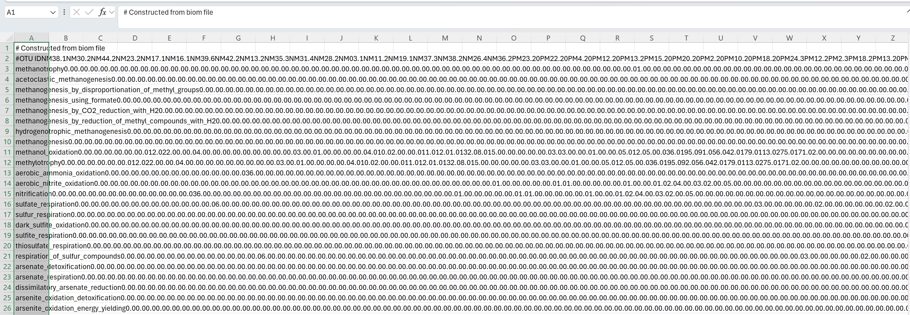
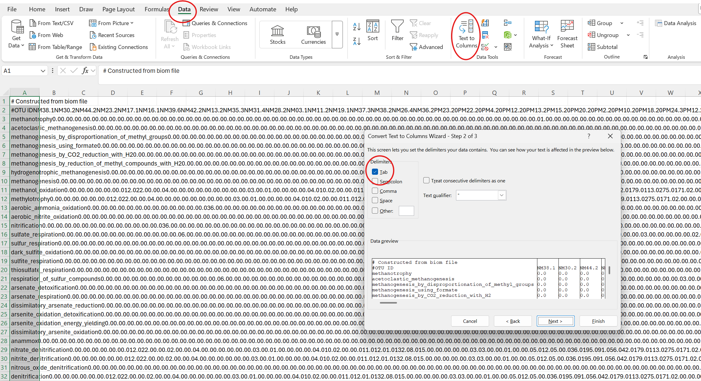
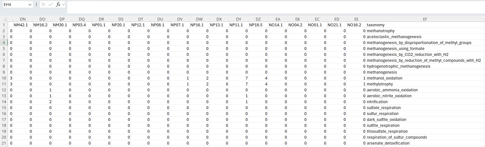
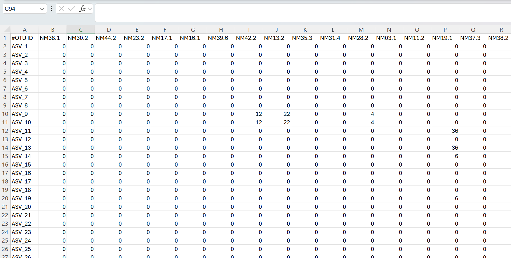
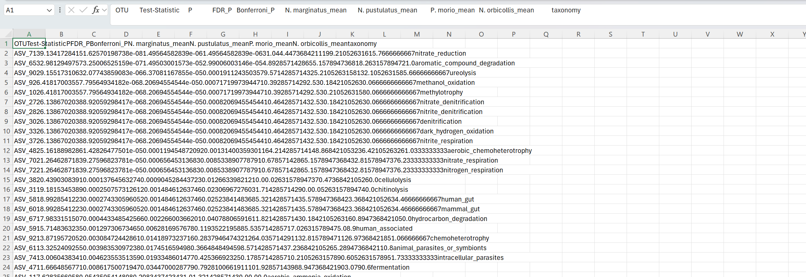
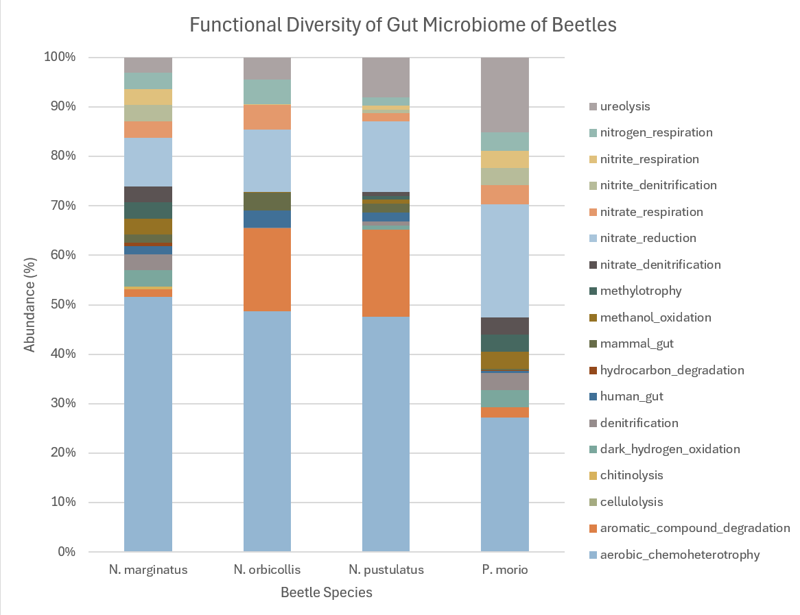

# Faprotax

Welcome to the final step of this workflow! In this section we will be using the package/database known as [FAPROTAX](http://www.loucalab.com/archive/FAPROTAX/lib/php/index.php?section=Home) in our bash shell to calculate our functional diversity, which we will use Excel to graph. What we mean by functional diversity is the composition of the functional groups in a microbiome. A functional group is composed of species that perform similar roles within an ecosystem (occupy the same/similar niches).


# Getting Started in Shell

Open your bash shell terminal, set your working directory, and load the necessary packages.

```shell
cd /work/labname/username/directory

module load python/3.7

module load biom-format

module load qiime/1.9

```

# Downloading FAPROTAX

Go to [this link](http://www.loucalab.com/archive/FAPROTAX/lib/php/index.php?section=Download) and download the latest release of FAPROTAX. Then upload the `FAPROTAX.txt` file and the `collapse_table.py` file from that download into to your working directory.

# Using FAPROTAX

For this tutorial, we will be using the `ASV_RAR.biom` file that we made in [Part 3](P3-Rarefaction.md#Rarefying) of this workflow. Use this command to run FAPROTAX in your working directory.

```shell
python collapse_table.py -i ASV_RAR_2708.biom -o func_div.biom -g FAPROTAX.txt --collapse_by_metadata "taxonomy" -v
```

Then we will convert it to a .txt file

```shell
biom convert -i func_div.biom -o func_div.txt --to-tsv
```

Open the `func_div.txt` file, select all of the text and paste it into an excel document.




# Excel Formatting

We will do a `Text to Columns` process similar to what we did for our differential abundance. First, select all of `column A` and then select the `Data` tab at the top of the screen and then select `Text to Columns` in the ribbon. Keep every setting the same except Step 2 in which you need to set you delimiter as `Tab`. When you're done hit `Finish`.



Now we are going to format this file to be compatible to move back into our bash shell to convert to a `biom_file` and run a group significance test on. First delete all of `row 1`. Then `copy` and `delete` the contents of `column A` and `paste` them at the end of your spreadsheet. Then rename `#OTU ID` to `taxonomy`.



Then go back to `Column A` and rename `cell A1` back to `#OTU ID`. Then name `cell A2` to `ASV_1` and drag that down to the bottom of the spreadsheet.



Now save this as a `tab delimited .txt file` and upload it to your working directory. For this example I named it `Func_Div_V2.txt`.

# Group Significance with FAPROTAX data

Now go back to your bash shell and use this command to convert the `.txt` file back to a `.biom` file.

```shell
biom convert -i Func_Div_V2.txt -o Func_Div_V2.biom --table-type="OTU table" --process-obs-metadata taxonomy --to-json
```
Now we will run `group_significance.py` using our metadata file and the same variable we chose for our differential abundance. For this I chose species.

```shell
group_significance.py -i Func_Div_V2.biom -m map.txt -c species -s kruskal_wallis -o Func_Div_Stat.csv --biom_samples_are_superset --print_non_overlap
```

# Graphing Functional Diversity in Excel

Now open the `Func_Div_Stat.csv` file we just created in Excel.



For this data we will be performing the same steps we did excel for [Part 6](P6-Differential_Abundance.md#Excel) of our workflow, if you need reminding you can go back to that section, otherwise here are the sparknotes:

1. Text to Columns
2. Choose a Statistical Method
3. Calculate Percent Values
4. Make a Pivot Table
5. Graph

When you're done you should end up with a graph looking something like this:



> [!Tip]
> When presenting these charts, you should attach text that says `p < 0.05` pasted on top of the chart on your slide to show that what you chose was statistically significant. Also 
> make sure to say what statistical methods you chose for each section.